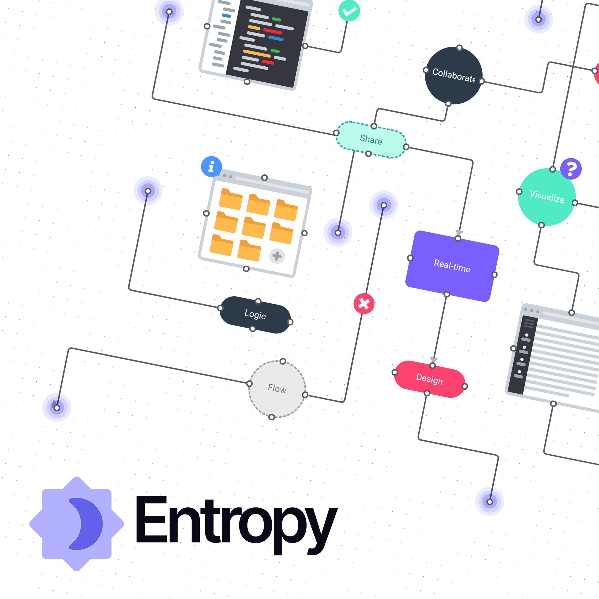

# Entropy
A real-time collaborative diagram editor using WebRTC and React. Entropy enables users to communicate visually in real-time with a local-first approach.

## 

## Getting started

### `yarn`
Install node package dependencies

### `yarn start`

Runs the app in local-first mode.\
Open [http://localhost:12000](http://localhost:12000) to view it in the browser.

The page will reload if you make edits.\
You will also see any lint errors in the console.

### Local-First Mode

By default, Entropy now runs in local-first mode, which:

- Uses WebRTC for peer-to-peer connections between collaborators
- Stores document data in your browser's IndexedDB
- Works without requiring a Firebase account
- Allows sharing documents via URLs that others can join

To share a document with others:
1. Create a new document
2. Click the "Share" button to get a shareable URL
3. Send this URL to collaborators
4. They can join directly without needing to sign up

For the best experience in local-first mode, collaborators should be on the same network or have direct connectivity.

### Cloud Mode

If you prefer to use the cloud-based version with Firebase:

```
yarn start:cloud
```

This will run the app with Firebase authentication and storage, and use WebSockets for collaboration.

### `yarn test`

Launches the test runner in the interactive watch mode.\
See the section about [running tests](https://facebook.github.io/create-react-app/docs/running-tests) for more information.

### `yarn build`

Builds the app for production to the `build` folder in local-first mode.\
It correctly bundles React in production mode and optimizes the build for the best performance.

To build for cloud mode:
```
yarn build:cloud
```

The build is minified and the filenames include the hashes.\
Your app is ready to be deployed!

See the section about [deployment](https://facebook.github.io/create-react-app/docs/deployment) for more information.

---

## Create React App

This project was scaffolded using [create-react-app](https://create-react-app.dev/)

## Learn More

You can learn more in the [Create React App documentation](https://facebook.github.io/create-react-app/docs/getting-started).

To learn React, check out the [React documentation](https://reactjs.org/).

### Code Splitting

This section has moved here: [https://facebook.github.io/create-react-app/docs/code-splitting](https://facebook.github.io/create-react-app/docs/code-splitting)

### Analyzing the Bundle Size

This section has moved here: [https://facebook.github.io/create-react-app/docs/analyzing-the-bundle-size](https://facebook.github.io/create-react-app/docs/analyzing-the-bundle-size)

### Making a Progressive Web App

This section has moved here: [https://facebook.github.io/create-react-app/docs/making-a-progressive-web-app](https://facebook.github.io/create-react-app/docs/making-a-progressive-web-app)

### Advanced Configuration

This section has moved here: [https://facebook.github.io/create-react-app/docs/advanced-configuration](https://facebook.github.io/create-react-app/docs/advanced-configuration)

### Deployment

This section has moved here: [https://facebook.github.io/create-react-app/docs/deployment](https://facebook.github.io/create-react-app/docs/deployment)

### `yarn build` fails to minify

This section has moved here: [https://facebook.github.io/create-react-app/docs/troubleshooting#npm-run-build-fails-to-minify](https://facebook.github.io/create-react-app/docs/troubleshooting#npm-run-build-fails-to-minify)

### Custom Build Configuration

### `yarn eject`

**Note: this is a one-way operation. Once you `eject`, you can’t go back!**

If you aren’t satisfied with the build tool and configuration choices, you can `eject` at any time. This command will remove the single build dependency from your project.

Instead, it will copy all the configuration files and the transitive dependencies (webpack, Babel, ESLint, etc) right into your project so you have full control over them. All of the commands except `eject` will still work, but they will point to the copied scripts so you can tweak them. At this point you’re on your own.

You don’t have to ever use `eject`. The curated feature set is suitable for small and middle deployments, and you shouldn’t feel obligated to use this feature. However we understand that this tool wouldn’t be useful if you couldn’t customize it when you are ready for it.